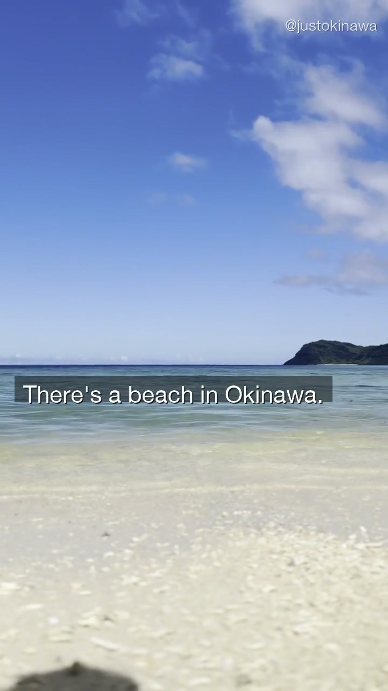
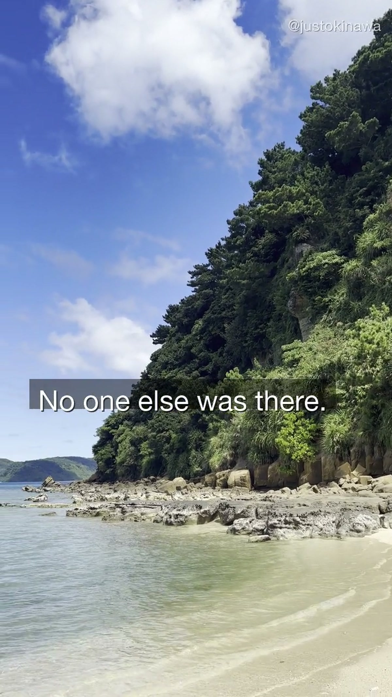
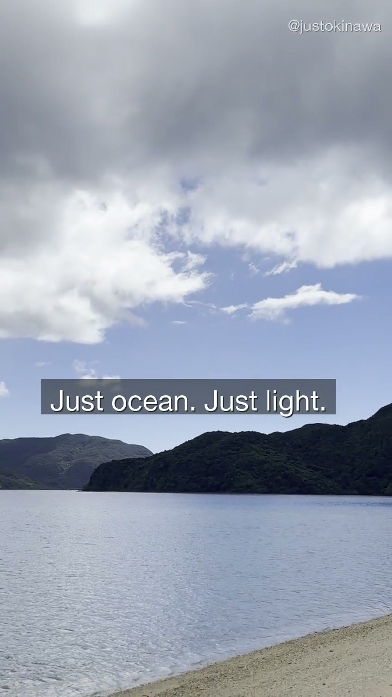
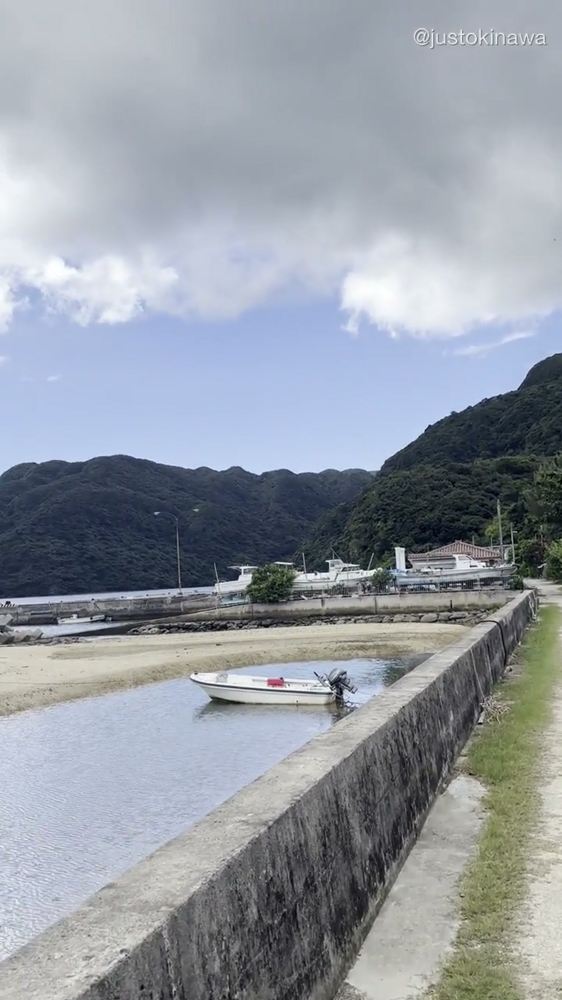
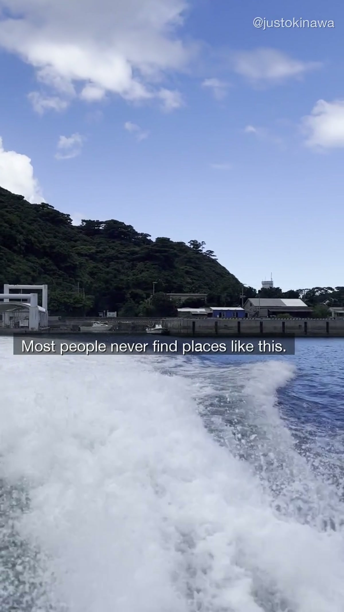

There's a specific kind of beach in Okinawa that doesn't show up in travel guides.

Not the famous ones with the white sand and the Instagram angles. Not the resort beaches with the lounge chairs and the beach vendors. The other kind — the ones where you show up, and there's no one else there.

We filmed OKI-005 at one of these places.

---

## What You're Not Seeing in the Photos

The images that define Okinawa online — the turquoise water, the perfect arc of sand, the clear sky — are real. But they're usually taken at the same handful of beaches, during peak season, cropped to remove the crowds standing just out of frame.

What the photos don't show:

- The beach that's a ten-minute walk from the main beach, which has the same water and no one on it
- The stretch of coast that doesn't have a parking lot or a facility, so most people skip it
- The light in the early morning, before anyone else arrives, when the ocean is completely still

This is what we were looking for when we shot OKI-005.

---

## October in Okinawa

We filmed this in early October. Technically still the tail end of summer — the water is warm, the light is strong, and the typhoon season is winding down.

October is an interesting month. It's not peak season anymore, so the main beaches are quieter. But it's warm enough that you'd still want to swim. The light is softer than July and August, which makes it better for filming.

The beach in OKI-005 is on the main island. We're not listing the exact location here — partly because places like this change when they get attention, and partly because finding it is part of the experience.

What we can say: if you walk past the main beach and keep going along the coast, there's usually something on the other side.

---

## The Feeling We Were Trying to Capture

The shot we kept coming back to while editing was the one where the ocean fills the entire frame — no horizon line, just water and light.

There's a specific feeling that happens when you're at a beach with no one else on it. It's not loneliness. It's more like the place is operating at its own speed, and you've arrived at the right time to see it.

Most travel content tries to make you want to go somewhere. We were trying to make you feel like you were already there.

---

## How to Find Beaches Like This

We get asked about this a lot. The honest answer is: don't search for them.

The beaches that show up in search results are the ones that have already been found. The ones we're filming are usually accessible by foot from a more popular beach, or down a road that doesn't look like it leads anywhere interesting.

A few practical notes:

- **Rent a car** — public transport doesn't go to the places worth finding
- **Go early** — even popular beaches are empty before 9am
- **Walk the coast** — most beaches connect to other beaches if you follow the waterline
- **October and January** — the best months for empty beaches and good light

**Browse Okinawa experiences:** [Viator Okinawa](https://www.viator.com/ja-JP/Okinawa/d5614-ttd?localeSwitch=1)

**Search Okinawa accommodation:** [Booking.com Okinawa](https://www.booking.com/region/jp/okinawa.html)

---

## The Short Version

The best beaches in Okinawa are the ones that aren't in the photos.

They're not hidden. They're just not in the right search results — and nobody's made a video about them yet.

Until now.

Follow along on [YouTube](https://www.youtube.com/@JustOkinawaJP), [TikTok](https://www.tiktok.com/@just_okinawa), and [Instagram](https://www.instagram.com/just_okinawa).

Drop a 🌊 in the comments on our YouTube video if you want the exact location.
