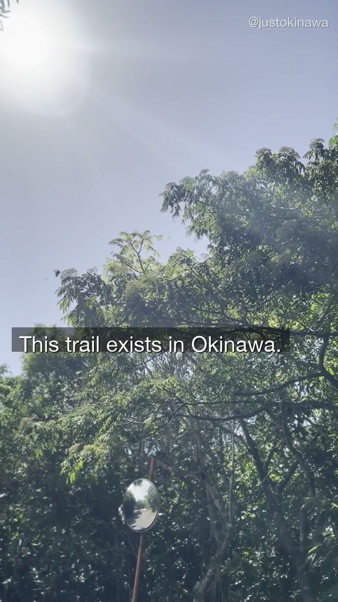
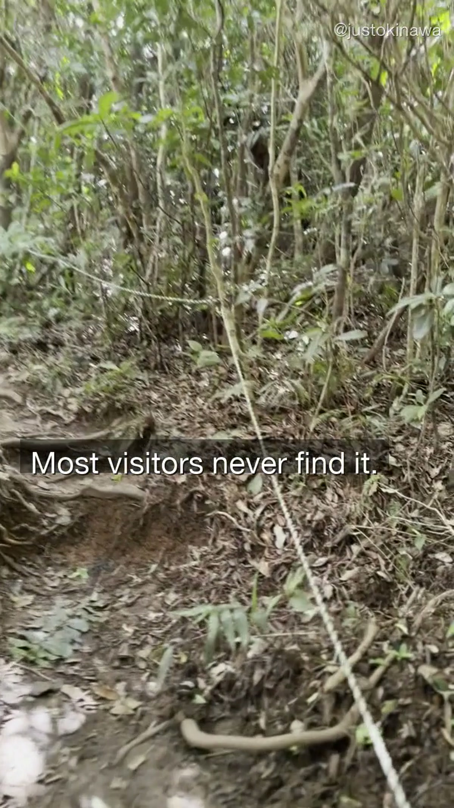
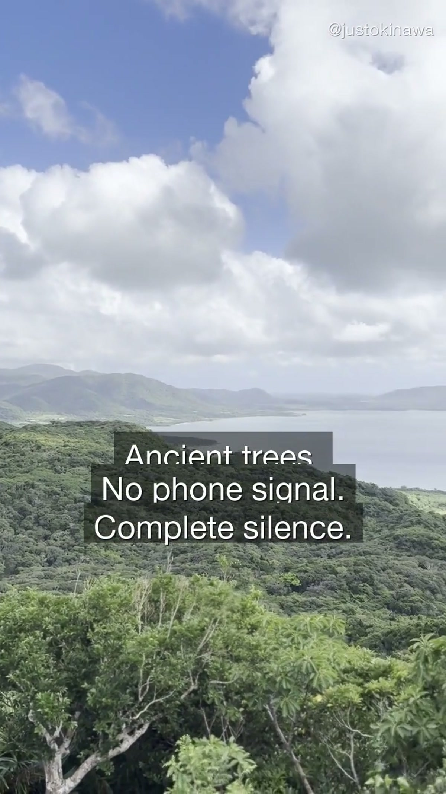
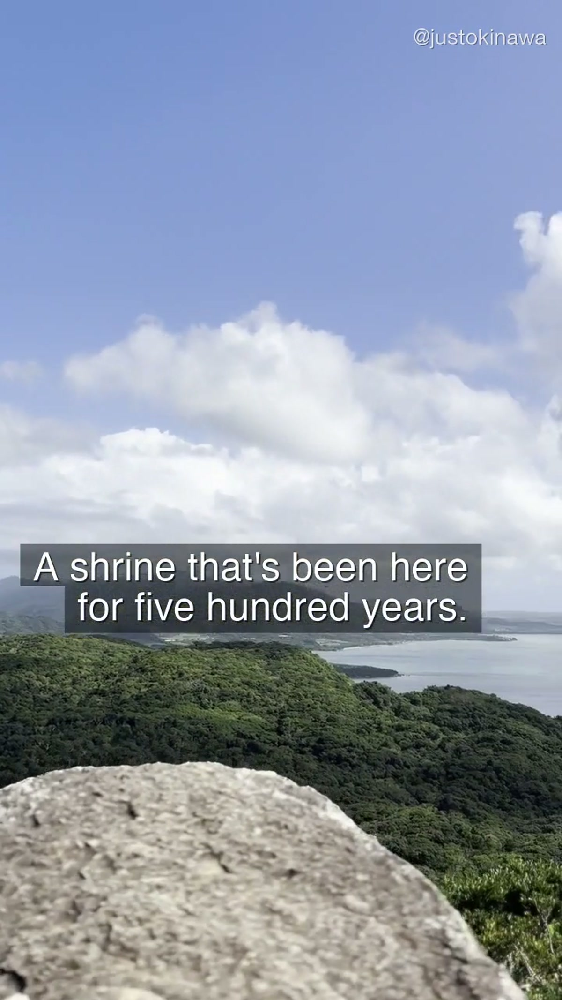

Most people who visit Okinawa spend their time on the coast. The beaches are real, the water is real, the sunsets are real — we're not going to pretend otherwise.

But there's another Okinawa that doesn't get talked about.

It's quieter. It's older. And it's an hour from the tourist strip.

---

## The Trail at Asmui

The trail we filmed for OKI-003 sits on Ishigaki Island, in an area most visitors pass through on the way to the beach. There's no parking lot. No entrance fee. No signs in English.

What's there instead:

- Ancient *ficus* trees so wide you can't wrap your arms around them
- A path that loses phone signal within ten minutes
- A sacred *utaki* shrine that feels untouched by time

Locals come here. The kind of locals who don't talk much about it.

---

## What Makes It Different

Most of Okinawa's famous natural spots have been discovered. Cape Manza. Emerald Beach. The Okinawan Churaumi Aquarium. These are good places. They're also busy.

This trail is not busy.

Part of that is because it doesn't look like much from the road. The entrance is unmarked. The first few minutes of walking are unremarkable — you're moving through second-growth forest.

Then it shifts.

The trees get older. The canopy closes. The light changes from white to gold-green. And the sound of the road disappears entirely.

---

## The Shrine

The shrine at the end of the trail is a *utaki* — a sacred site in Okinawan spiritual tradition. These aren't Buddhist temples or Shinto shrines imported from the mainland. They're indigenous to Okinawa, and many predate the Japanese annexation of the Ryukyu Kingdom.

There are no guides, no explanations, no gift shops. You walk up, you look at it, you leave.

If you go: be quiet. Don't touch the offerings. Take nothing.

---

## When to Go

The trail is best in the morning, when the light comes through the trees at a low angle. By midday the canopy blocks most of the sun, which keeps it cool but changes the atmosphere significantly.

**Go early.** Bring water. Wear shoes you can actually walk in.

The trail takes about 40 minutes round trip if you move slowly and stop to look at things. That's the right pace.

---

## Getting There

The trail is on Ishigaki Island. We're not going to post the exact location here — the last thing this place needs is a tourist infrastructure.

Drop a 📍 in the comments on our [YouTube video](https://www.youtube.com/@JustOkinawaJP) and we'll send you directions directly.

---

## Staying on Ishigaki

If you're basing yourself on Ishigaki Island to explore places like this, there are small guesthouses and locally-run hotels worth considering. Nothing fancy — but you wake up on an island that most visitors only pass through.

**Search Ishigaki accommodation:** [Booking.com Okinawa](https://www.booking.com/region/jp/okinawa.html)

---

## A Note on Sacred Sites

Okinawa has hundreds of *utaki* scattered across the islands. Many are unmarked. Many are still actively used in ceremonies that outsiders are not invited to.

If you come across one — marked or not — treat it the way you'd want someone to treat a place that matters to you.

Look. Don't touch. Be quiet. Leave.

That's the whole policy.

---

Follow along on [YouTube](https://www.youtube.com/@JustOkinawaJP), [TikTok](https://www.tiktok.com/@just_okinawa), and [Instagram](https://www.instagram.com/just_okinawa) — we post new videos every week.

Browse Okinawa tours and experiences: [Viator Okinawa](https://www.viator.com/ja-JP/Okinawa/d5614-ttd?localeSwitch=1)
