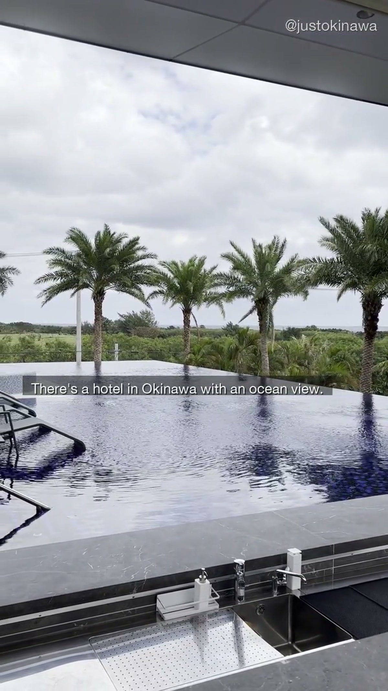
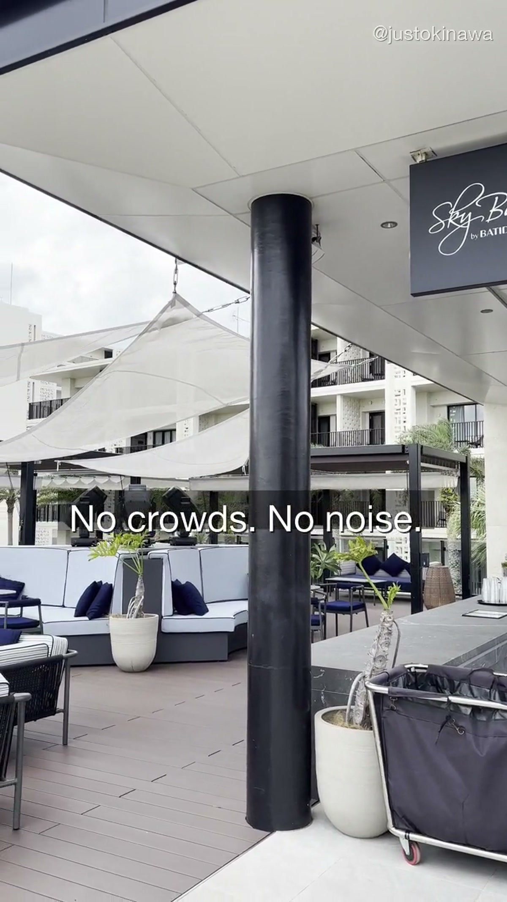
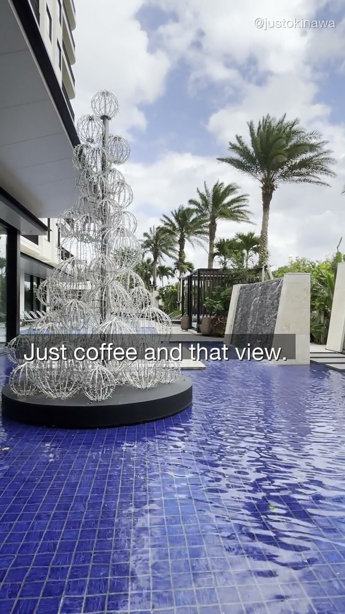
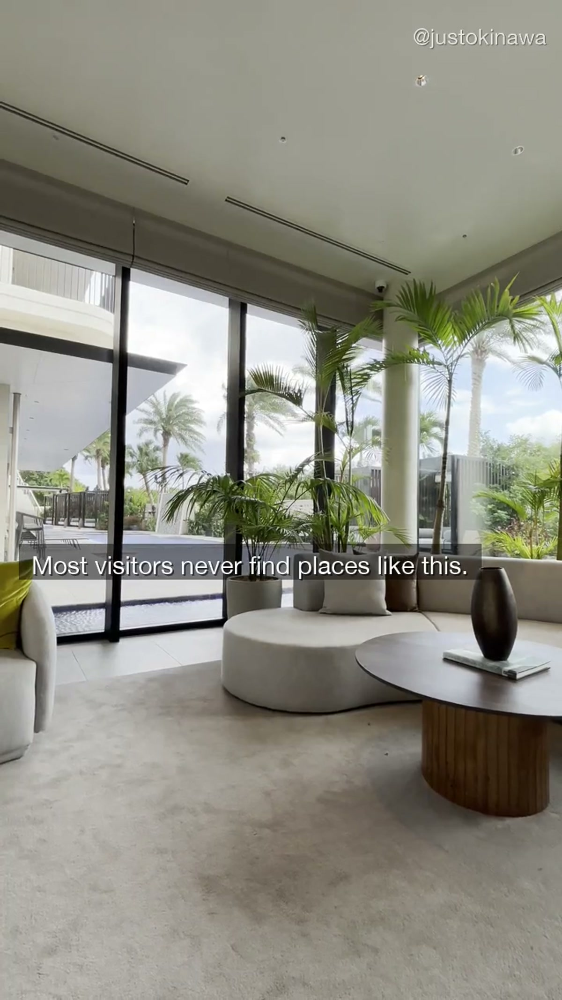

Most hotel recommendations in Okinawa follow the same pattern. Big resort. Private beach. Pool with a swim-up bar. Full buffet breakfast.

These hotels exist. They're fine. They're also not what we're talking about.

---

## The Other Kind of Hotel

The place in our OKI-004 video sits on Ishigaki Island. It has an ocean view — a real one, not the kind you have to crane your neck to see from a corner room on the fourth floor.

What it doesn't have:

- A lobby full of tour groups
- A check-in queue
- Background music engineered to make you feel like you're already on vacation

What it does have is quiet. The kind of quiet that feels earned.

We filmed this in January, which is part of why it looks the way it does. January in Okinawa is off-season. The water is still blue. The light is still good. The average temperature sits around 17°C — cool enough to need a layer in the morning, warm enough to sit outside by noon.

And the hotels are genuinely empty.

---

## Why January Works

The conventional wisdom is that Okinawa is a summer destination. July and August are peak season — the beaches are full, the prices are high, and the weather is hot enough that you spend most of your time in the water or the air conditioning.

January is different.

- Prices drop by 30–50% at most properties
- The popular beaches are empty
- You can get a table at restaurants without waiting
- The light is softer and more cinematic

The trade-off is the ocean temperature. You won't be swimming. But if you're coming to Okinawa to look at it — and a lot of people are — January is arguably the best month to do that.

---

## The View From the Window

The shot we kept coming back to while editing OKI-004 was the one through the window. Interior in the foreground — the textures of the room, the light on a coffee cup — and then the ocean beyond the glass.

It's a specific feeling. Being inside somewhere warm and quiet while that much water sits outside. Not urgent. Not Instagram-optimized. Just present.

Most travel content from Okinawa is shot on the beach, facing outward. There's a version of it that's worth exploring from the inside, looking out.

---

## Where to Stay

We're not listing this specific property here — partly because places like this tend to change when they get too much attention, and partly because the right hotel depends on what you're actually looking for.

What we can say: Ishigaki Island has a handful of hotels that get the ocean view right — not the massive resort chains, but the smaller properties where the view is the whole point. Search for boutique hotels and guesthouses on Ishigaki rather than the large resorts. The properties you want aren't the ones that show up first in the search results.

**Search Okinawa accommodation:** [Booking.com Okinawa](https://www.booking.com/region/jp/okinawa.html)

---

## Things to Do on Ishigaki

If you're basing yourself on Ishigaki and you're not there just to swim, there's still plenty to do:

- **Sunset watching** — Ishigaki's west-facing shores have some of the best sunsets in all of Okinawa
- **Kabira Bay** — the most photographed bay in Okinawa, worth seeing in the early morning before the tour boats arrive
- **Local food** — Ishigaki beef, fresh seafood, and local restaurants that don't appear on any English-language review site
- **Island hopping** — Taketomi, Kohama, and Iriomote are all a short ferry ride away

**Browse Okinawa experiences:** [Viator Okinawa](https://www.viator.com/ja-JP/Okinawa/d5614-ttd?localeSwitch=1)

---

## The Short Version

The best hotel experience in Okinawa isn't the one with the biggest pool. It's the one where you sit with a coffee at 8am, look at the Pacific, and have nothing you need to do next.

Most visitors never find places like this. Not because they're hidden — but because they're not in the right search results, and nobody's made a video about them yet.

Until now.

Follow along on [YouTube](https://www.youtube.com/@JustOkinawaJP), [TikTok](https://www.tiktok.com/@just_okinawa), and [Instagram](https://www.instagram.com/just_okinawa).

Drop a 🌊 in the comments on our YouTube video if you want the exact location.
