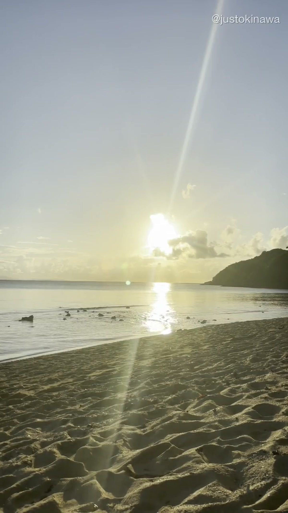
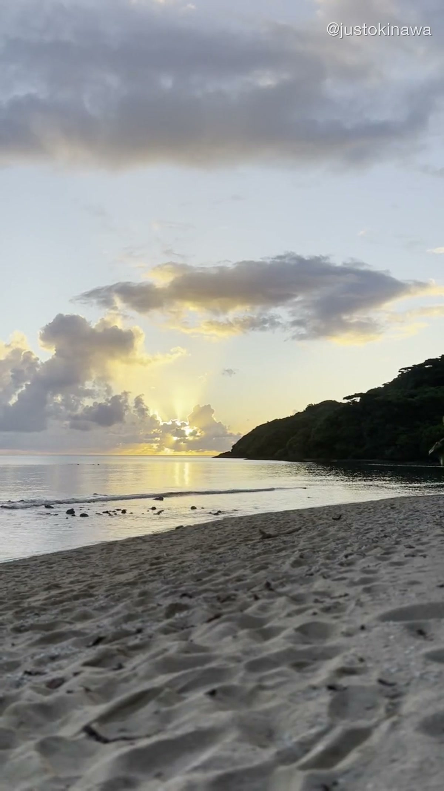
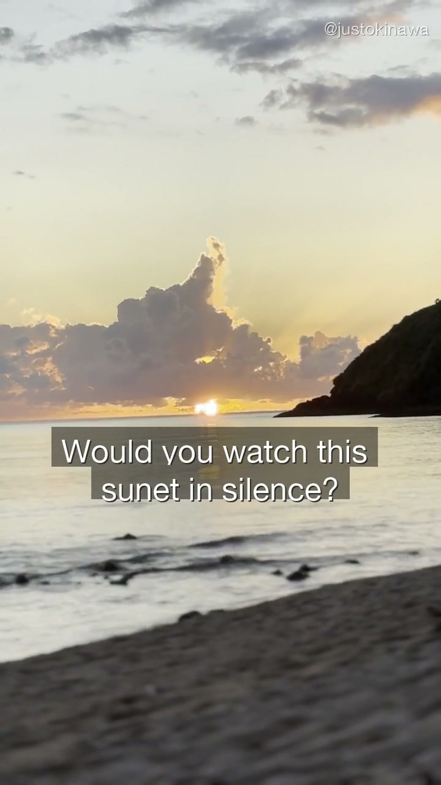
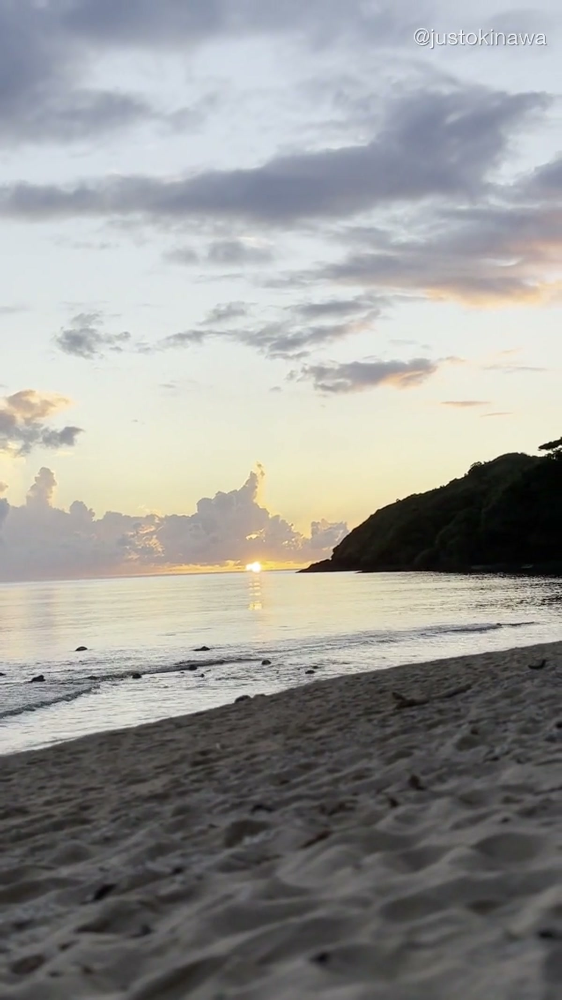

Most people leave the beach by 5pm. Sunscreen washed off, towels packed, already thinking about dinner.

They miss it every time.

Okinawa's sunsets aren't like the ones you've seen on Instagram. There's no single perfect moment — it's a slow burn that lasts 40 minutes, moving through orange, then magenta, then a deep gold that sits on the water long after the sun is gone.

And on the west-facing beaches of the main island, you get the full show.

---

## Why Okinawa Sunsets Are Different

Okinawa sits at the edge of the East China Sea. The water is shallow for miles offshore — which means when the light hits it at golden hour, it doesn't just reflect. It *glows*.

The color comes from the combination of:
- The angle of the sun (Okinawa is further south than most of Japan)
- The clarity of the water (less particulate matter = cleaner light scatter)
- The humidity (the haze creates a soft-focus effect that makes the colors bloom)

On a clear evening in late September, the sky goes through six or seven distinct color phases in under an hour. Locals call it the "Okinawa hour." Visitors who catch it for the first time tend to go quiet.

---

## The Beach in the Video

The beach in our OKI-002 video is on the west coast of the main island — a flat, open stretch with no development behind it. No resort. No beach bar. Just sand, water, and the horizon.

We filmed this in August, during the last week of peak summer. The tourist crowds had thinned out slightly, but the light was still perfect — golden hour in August lasts longer in Okinawa than anywhere else we've filmed.

What you're seeing in the video is ungraded. No color correction, no filters. This is exactly what it looked like standing there.

---

## When to Go

**September and October are the best months for Okinawa sunsets.**

Here's why:
- The typhoon season is winding down, which means dramatic cloud formations
- The humidity drops slightly, so the colors are sharper
- Fewer tourists than July/August, so the beaches are quieter
- The sun sets around 6:30–7pm — late enough that you can get dinner after

Avoid facing-east beaches. They're good for sunrise, but you lose the full color show at sunset.

---

## How to Watch It Right

1. **Get there 30 minutes early.** The light starts changing before the sun actually sets.
2. **Don't watch through your phone the whole time.** Take a few photos, then put it down.
3. **Stay for 20 minutes after sunset.** The afterglow — what photographers call "civil twilight" — is often better than the sunset itself.
4. **Bring something to sit on.** The good spots fill up with locals after 5:30pm.

---

## Where to Stay

If you want to catch sunsets like this every evening, the west coast of Okinawa's main island is worth basing yourself in. There are a handful of small hotels and guesthouses that sit directly on the beach — nothing fancy, but you wake up with the water outside your window.

We'll be posting location-specific recommendations as we go. For now, search for accommodation in the Yomitan or Onna area on the west coast — that's the stretch where the sunsets are consistently best.

**Book Okinawa accommodations:** [Booking.com Okinawa](https://www.booking.com/region/jp/okinawa.html)

---

## Tours and Experiences at Sunset

If you want a guided experience at golden hour, there are a few options worth considering:

- **Sunset kayaking** — paddle out into the water as the sky changes color
- **Sunset boat tours** — get offshore for the full panoramic view
- **Beach BBQ** — local operators run evening grills right on the sand

**Browse Okinawa sunset tours:** [Viator Okinawa](https://www.viator.com/ja-JP/Okinawa/d5614-ttd?localeSwitch=1)

---

## The Short Version

Okinawa's sunsets are the part of the island that doesn't show up in travel guides. They're not a landmark. You can't book them. You just have to show up, face west, and wait.

We've been watching them for years. They still stop us.

Follow along on [YouTube](https://www.youtube.com/@JustOkinawaJP), [TikTok](https://www.tiktok.com/@just_okinawa), and [Instagram](https://www.instagram.com/just_okinawa) — we post the full videos every week.

Drop a 📍 in the comments on our YouTube video if you want the exact beach location.
