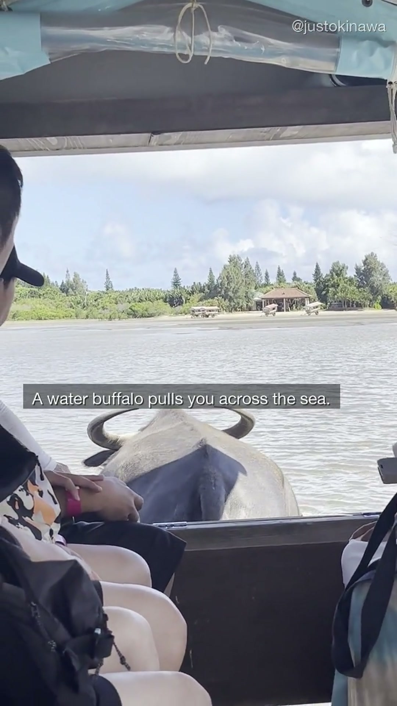
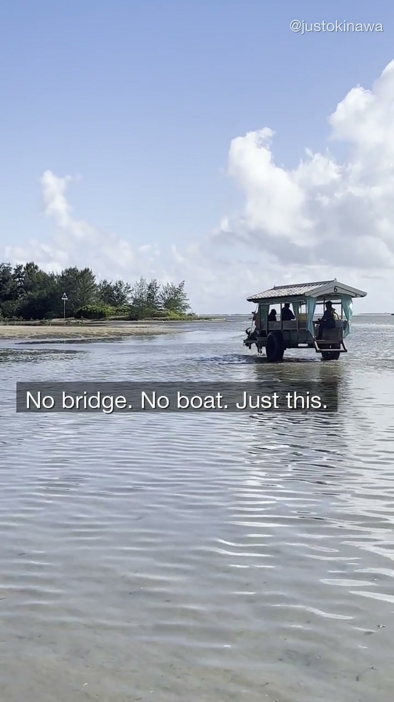
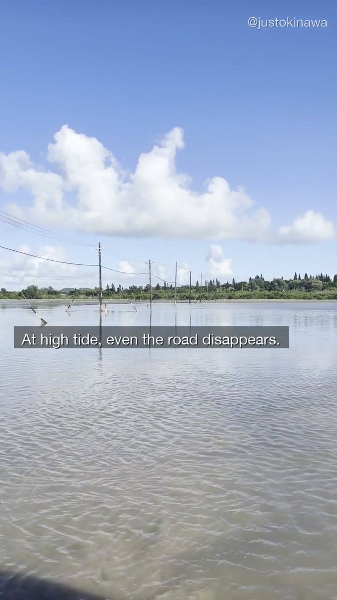

In OKI-001, we teased it. A water buffalo pulling a cart across the sea. No explanation. Just the image.

This is what we were talking about.

---

## What Yubu Island Actually Is

Yubu Island (由布島) sits about 400 meters off the coast of Iriomote Island in Okinawa's Yaeyama archipelago. It's small — you can walk around it in twenty minutes. The island has a butterfly garden and a few palm trees.

What makes it unusual is how you get there.

There's no bridge. There's no ferry. The only way across is a water buffalo cart — a wooden carriage pulled through the tidal flat by a single buffalo, moving at the speed of an animal that has been doing this its whole life.

---

## The Crossing

The tidal flat between Iriomote and Yubu Island is shallow enough to walk — ankle to knee-deep at low tide. The buffalo don't seem to mind the water. They've done this crossing thousands of times.

You sit in the cart. A driver sits up front. The buffalo walks. That's all there is to it.

The whole crossing takes about ten minutes. There's something about being pulled through the sea by an animal — not a boat, not a vehicle — that doesn't fit into any category of travel you've done before.

---

## What Happens at High Tide

The tidal flat isn't always visible. At high tide, the water level rises and the route between the islands disappears entirely. The power lines that run between Iriomote and Yubu Island — the ones that keep the lights on — stand above flooded ground. The road under the water is still there. You just can't see it.

The buffalo still cross. They just do it through deeper water.

---

## How to Get There

Yubu Island is reached from the village of Komi (古見) on the southern coast of Iriomote Island. From Ishigaki Island, take the ferry to Ohara Port (大原港) on Iriomote, then a bus or taxi west along the coast to the water buffalo departure point.

The service runs throughout the day and costs around ¥1,400 round trip. You don't need a reservation for a standard visit.

If you're already planning a trip to Iriomote for the jungle, the mangroves, or the rivers — Yubu Island is thirty minutes from the ferry terminal and completely worth the detour.

---

## The Short Version

400 meters offshore. No bridge. No ferry. A water buffalo walks you across.

At high tide, even the road disappears — but the buffalo still go.

Follow along on [YouTube](https://www.youtube.com/@JustOkinawaJP), [TikTok](https://www.tiktok.com/@just_okinawa), and [Instagram](https://www.instagram.com/just_okinawa).

Drop a 🐃 in the comments on our YouTube video if you want the exact departure point and schedule.
