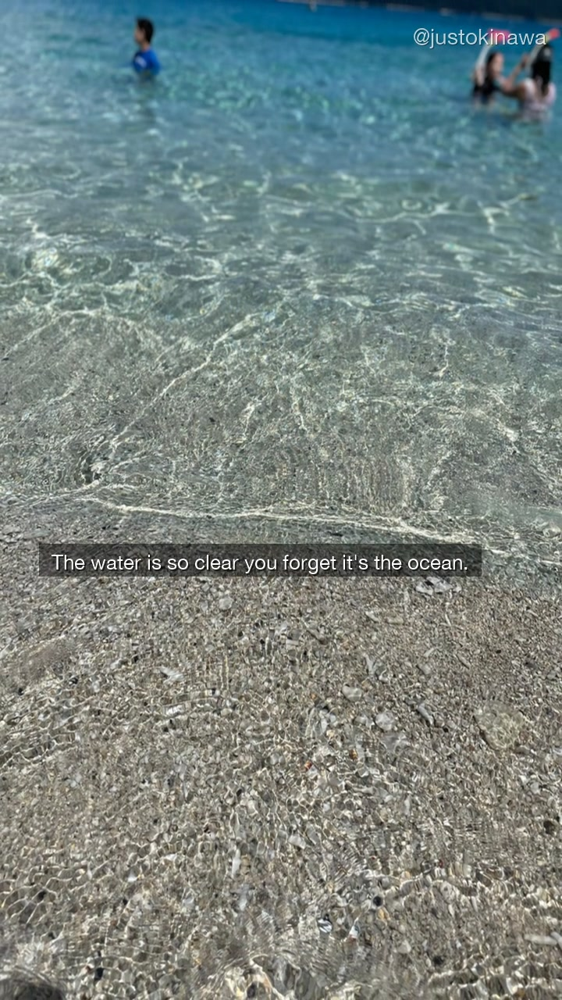
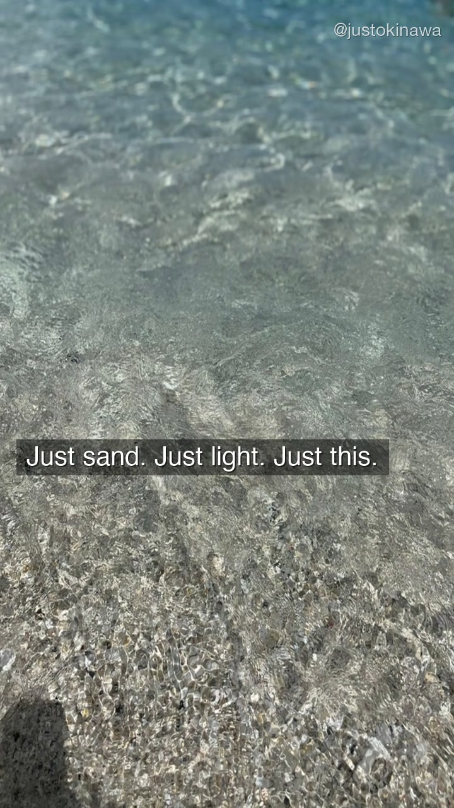
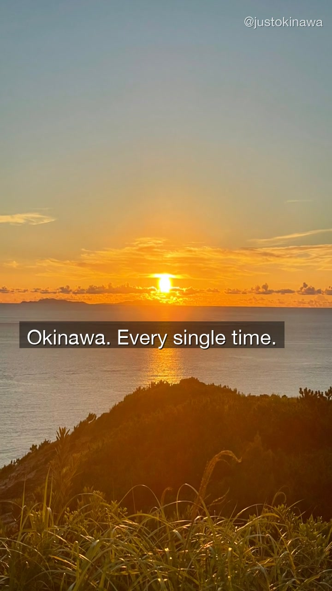

There are beaches in Okinawa that look fake.

Zamami Island is one of them.

---

## What Zamami Actually Is

Zamami Island (座間味島) sits in the Kerama Islands — a chain of small islands about 40 kilometers west of Naha. This is where the phrase *Kerama Blue* comes from. Not a marketing term. An actual color that exists in the water here and almost nowhere else.

The island itself is small. A few hundred residents. One main beach. A handful of guesthouses and dive shops. No large resorts. No convenience stores open late. The kind of place that runs on its own schedule and doesn't adjust for you.

---

## The Water

Standing in the shallows at Zamami, you forget you're in the ocean.

The water is so clear you can see the sand shifting underneath your feet. The sea floor is visible at depths that shouldn't be visible. Snorkelers drift past without disappearing — you can track them the whole way across.

It doesn't look like the Pacific. It looks like a swimming pool that happened to connect to the sea.

---

## August on Zamami

August is the peak of summer in Okinawa. The light is harsh. The water temperature is warm. The beaches fill up — but not the way beaches fill up on the main island. Zamami's crowds are still measured in dozens, not hundreds.

What August gives you that other months don't: the sun sets over the hills to the west, and when it goes, it goes all at once. One moment it's afternoon. The next, the sky is orange and the ocean catches the light.

We filmed this in the last week of August. The angle of the sun, the grass moving in the wind, the way the reflection stretched across the water — it was the kind of shot you don't plan for.

---

## How to Get There

Zamami Island is reached by ferry from Tomari Port (泊港) in Naha.

- **High-speed ferry (クイーンざまみ)**: approximately 50 minutes, runs multiple times daily
- **Standard ferry**: approximately 2 hours, less frequent

Day trips are possible, but staying overnight changes the experience entirely. The island after the last ferry leaves is a different place.

**Book Zamami accommodation:** [Booking.com Okinawa](https://www.booking.com/region/jp/okinawa.html)

**Kerama Islands experiences:** [Viator Okinawa](https://www.viator.com/ja-JP/Okinawa/d5614-ttd?localeSwitch=1)

---

## The Short Version

50 minutes from Naha. Water so clear it doesn't look real. And then the sun sets like that.

This is Zamami Island. August. Okinawa.

Follow along on [YouTube](https://www.youtube.com/@JustOkinawaJP), [TikTok](https://www.tiktok.com/@just_okinawa), and [Instagram](https://www.instagram.com/just_okinawa).

Drop a 🌊 in the comments on our YouTube video if you want the exact beach name and ferry schedule.
